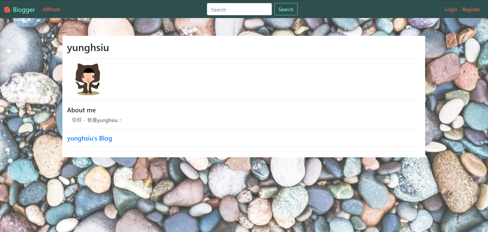

nodejs-blog
===
This project is a simple blog built with Node.js, Express & PostgreSQL. \
Provide some basic functions, including:
- register
- forget-password
- post
- comment
- category
- views counter

This project is deployed on Heroku for backend service and used Cloudinary for image management.

link: https://nodejs-blog-2020.herokuapp.com/

Demo
---
### index page

### read a post

### create/edit a post

### user's profile

